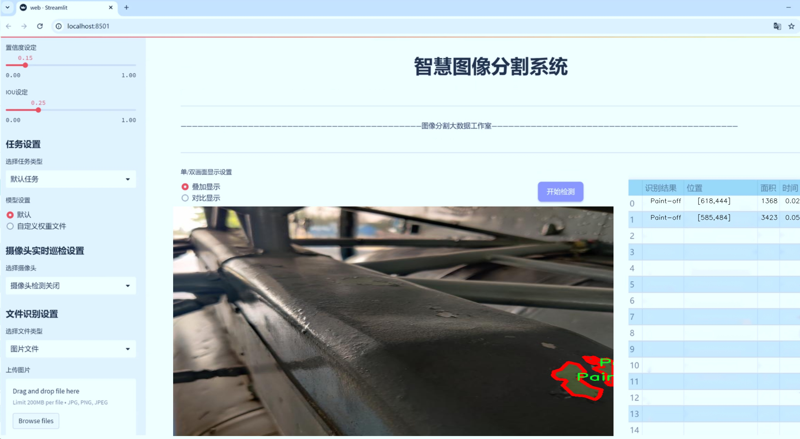
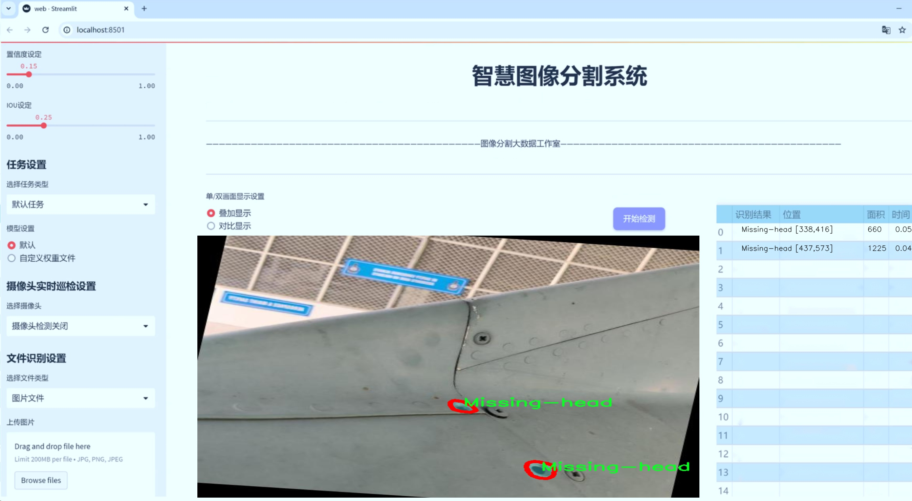
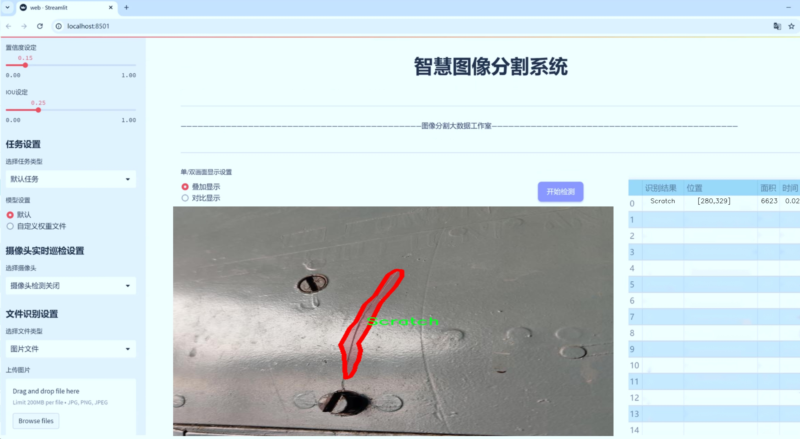
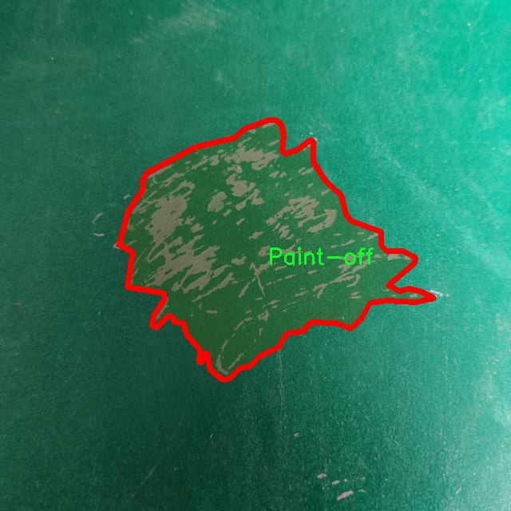
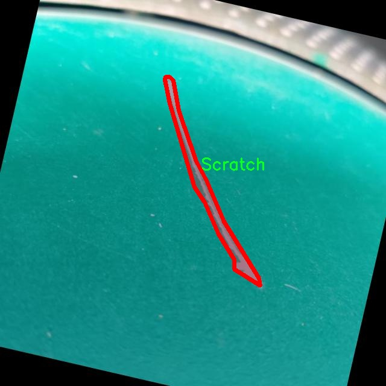
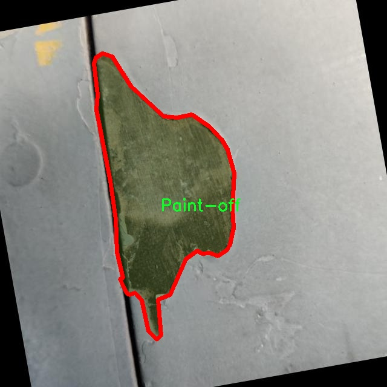
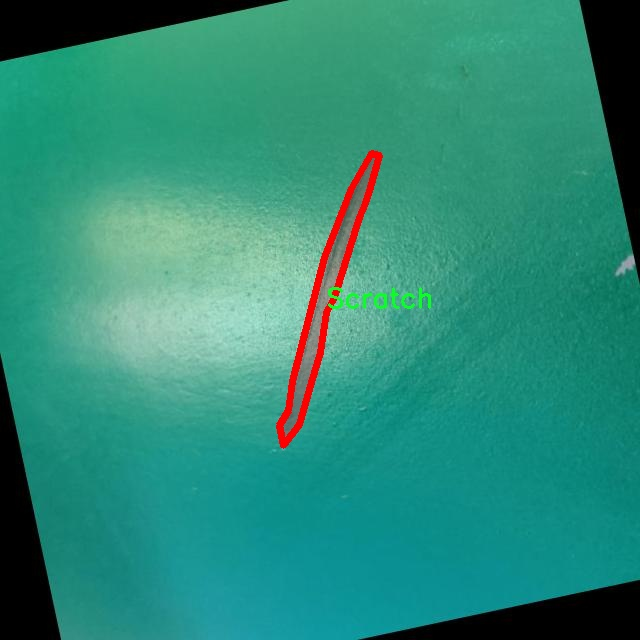
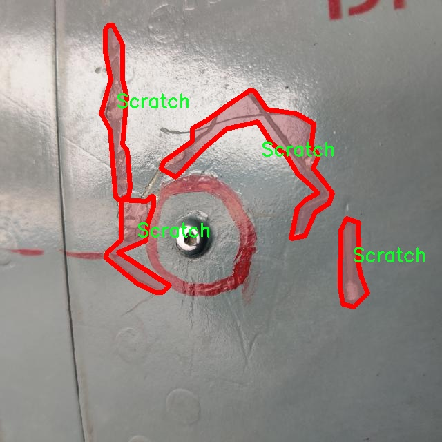

# 工件表面缺陷分割系统： yolov8-seg-CSwinTransformer

### 1.研究背景与意义

[参考博客](https://gitee.com/YOLOv8_YOLOv11_Segmentation_Studio/projects)

[博客来源](https://kdocs.cn/l/cszuIiCKVNis)

研究背景与意义

随着工业生产的不断发展，工件表面缺陷的检测与分割技术在保证产品质量、提高生产效率方面扮演着越来越重要的角色。传统的人工检测方法不仅耗时耗力，而且容易受到人为因素的影响，导致漏检和误检的现象。因此，基于计算机视觉的自动化检测系统逐渐成为研究的热点。近年来，深度学习技术的快速发展为工件表面缺陷的自动检测提供了新的思路和方法，尤其是实例分割技术的应用，使得对复杂背景下的缺陷进行精确定位和分类成为可能。

YOLO（You Only Look Once）系列模型因其高效的实时检测能力而广泛应用于目标检测领域。YOLOv8作为该系列的最新版本，结合了多种先进的网络结构和优化算法，展现出更高的检测精度和速度。然而，尽管YOLOv8在目标检测上取得了显著成效，但在工件表面缺陷的实例分割任务中，仍然面临着一些挑战，如小目标的检测精度不足、背景复杂情况下的分割效果不理想等。因此，针对YOLOv8进行改进，以提升其在工件表面缺陷分割任务中的表现，具有重要的研究意义。

本研究基于改进YOLOv8的工件表面缺陷分割系统，利用2600张图像构建的数据集，涵盖了六类缺陷：裂纹、凹陷、缺头、脱漆、划痕和其他物体。这些缺陷的多样性和复杂性为模型的训练和评估提供了丰富的样本，能够有效提升模型的泛化能力和适应性。通过对这些缺陷进行实例分割，不仅可以实现对缺陷位置的精确定位，还能够为后续的缺陷分析和处理提供可靠的数据支持。

此外，工件表面缺陷的自动检测与分割系统的研究，不仅能够提高工业生产的自动化水平，还能够降低人工成本，提升生产效率，减少因缺陷导致的经济损失。通过实现对工件表面缺陷的快速、准确检测，企业能够在生产过程中及时发现问题，进行相应的调整和优化，从而保证产品质量，增强市场竞争力。

总之，基于改进YOLOv8的工件表面缺陷分割系统的研究，不仅具有重要的理论价值，也具备广泛的应用前景。通过深入探讨该系统的设计与实现，能够为相关领域的研究提供新的思路和方法，推动工业自动化检测技术的发展，最终实现智能制造的目标。

### 2.图片演示







注意：本项目提供完整的训练源码数据集和训练教程,由于此博客编辑较早,暂不提供权重文件（best.pt）,需要按照6.训练教程进行训练后实现上图效果。

### 3.视频演示

[3.1 视频演示](https://www.bilibili.com/video/BV1REzUYaEAU/)

### 4.数据集信息

##### 4.1 数据集类别数＆类别名

nc: 6
names: ['Crack', 'Dent', 'Missing-head', 'Paint-off', 'Scratch', 'object']


##### 4.2 数据集信息简介

数据集信息展示

在本研究中，我们采用了名为“Segment 4x4”的数据集，以训练和改进YOLOv8-seg的工件表面缺陷分割系统。该数据集专注于工件表面的缺陷检测，旨在提升自动化检测的准确性和效率。数据集的设计充分考虑了工业应用的实际需求，涵盖了多种常见的表面缺陷类型，为模型的训练提供了丰富的样本和多样化的场景。

“Segment 4x4”数据集包含六个主要类别，分别是：Crack（裂纹）、Dent（凹陷）、Missing-head（缺头）、Paint-off（漆面脱落）、Scratch（划痕）和object（其他物体）。这些类别的选择基于对工业生产过程中常见缺陷的深入分析，确保了数据集的实用性和针对性。每个类别都代表了工件表面可能出现的不同缺陷，反映了实际生产中可能遇到的各种问题。

裂纹（Crack）是工件表面缺陷中最为常见的一种，通常由于材料疲劳、冲击或热应力等因素导致。数据集中包含了多种形态和大小的裂纹样本，以帮助模型学习如何准确识别和分割不同类型的裂纹。凹陷（Dent）则是另一种常见的缺陷，通常由外力作用造成。数据集中的凹陷样本展示了不同深度和形状的凹陷特征，增强了模型对该类缺陷的识别能力。

缺头（Missing-head）缺陷主要出现在机械零件中，指的是零件的某个部分缺失。该类别在数据集中提供了多种角度和光照条件下的样本，确保模型能够在不同环境下有效识别缺头问题。漆面脱落（Paint-off）则涉及到表面涂层的完整性，通常影响到工件的外观和防腐性能。数据集中包含了不同程度的漆面脱落样本，帮助模型理解漆面损伤的特征。

划痕（Scratch）是另一种影响工件外观和性能的缺陷，通常由摩擦或碰撞造成。数据集中的划痕样本涵盖了从轻微划痕到深度划痕的多种情况，确保模型能够适应不同的划痕特征。最后，object（其他物体）类别则用于标识工件表面上可能出现的非缺陷物体，帮助模型在复杂背景中进行更准确的分割。

通过使用“Segment 4x4”数据集，我们能够有效地训练YOLOv8-seg模型，使其在工件表面缺陷分割任务中表现出色。数据集的多样性和丰富性为模型提供了坚实的基础，使其能够在实际应用中实现高效、准确的缺陷检测。这不仅提高了工业生产的自动化水平，也为后续的质量控制和维护提供了有力支持。随着数据集的不断扩展和优化，我们期望能够进一步提升模型的性能，为工件表面缺陷检测领域的发展贡献力量。











### 5.项目依赖环境部署教程（零基础手把手教学）

[5.1 环境部署教程链接（零基础手把手教学）](https://www.bilibili.com/video/BV1jG4Ve4E9t/?vd_source=bc9aec86d164b67a7004b996143742dc)


[5.2 安装Python虚拟环境创建和依赖库安装视频教程链接（零基础手把手教学）](https://www.bilibili.com/video/BV1nA4VeYEze/?vd_source=bc9aec86d164b67a7004b996143742dc)

### 6.手把手YOLOV8-seg训练视频教程（零基础手把手教学）

[6.1 手把手YOLOV8-seg训练视频教程（零基础小白有手就能学会）](https://www.bilibili.com/video/BV1cA4VeYETe/?vd_source=bc9aec86d164b67a7004b996143742dc)


按照上面的训练视频教程链接加载项目提供的数据集，运行train.py即可开始训练



     Epoch   gpu_mem       box       obj       cls    labels  img_size
     1/200     0G   0.01576   0.01955  0.007536        22      1280: 100%|██████████| 849/849 [14:42<00:00,  1.04s/it]
               Class     Images     Labels          P          R     mAP@.5 mAP@.5:.95: 100%|██████████| 213/213 [01:14<00:00,  2.87it/s]
                 all       3395      17314      0.994      0.957      0.0957      0.0843

     Epoch   gpu_mem       box       obj       cls    labels  img_size
     2/200     0G   0.01578   0.01923  0.007006        22      1280: 100%|██████████| 849/849 [14:44<00:00,  1.04s/it]
               Class     Images     Labels          P          R     mAP@.5 mAP@.5:.95: 100%|██████████| 213/213 [01:12<00:00,  2.95it/s]
                 all       3395      17314      0.996      0.956      0.0957      0.0845

     Epoch   gpu_mem       box       obj       cls    labels  img_size
     3/200     0G   0.01561    0.0191  0.006895        27      1280: 100%|██████████| 849/849 [10:56<00:00,  1.29it/s]
               Class     Images     Labels          P          R     mAP@.5 mAP@.5:.95: 100%|███████   | 187/213 [00:52<00:00,  4.04it/s]
                 all       3395      17314      0.996      0.957      0.0957      0.0845


### 7.50+种全套YOLOV8-seg创新点加载调参实验视频教程（一键加载写好的改进模型的配置文件）

[7.1 50+种全套YOLOV8-seg创新点加载调参实验视频教程（一键加载写好的改进模型的配置文件）](https://www.bilibili.com/video/BV1Hw4VePEXv/?vd_source=bc9aec86d164b67a7004b996143742dc)

### YOLOV8-seg算法简介

原始YOLOv8-seg算法原理

YOLOv8-seg算法是2023年1月10日由Ultralytics公司推出的最新一代目标检测与实例分割模型，代表了YOLO系列算法的又一次重大进步。该算法不仅在目标检测任务中表现出色，还通过对图像进行精细的分割处理，进一步提升了在计算机视觉领域的应用能力。YOLOv8-seg的设计理念是将目标检测与实例分割相结合，形成一个统一的框架，使得模型在处理复杂场景时能够同时识别和分割目标物体，提供更为全面的信息。

YOLOv8-seg的核心在于其独特的网络结构和创新的技术实现。与之前的YOLO版本相比，YOLOv8-seg在多个方面进行了优化，特别是在骨干网络、特征融合和检测头的设计上。首先，YOLOv8-seg采用了全新的骨干网络，旨在通过更深的卷积神经网络结构来提高特征提取的能力。该骨干网络使用了C2f模块，取代了传统的C3模块，增加了更多的跳层连接和Split操作，这不仅提高了信息流动的效率，还增强了模型对多尺度目标的适应能力。

在特征融合方面，YOLOv8-seg继续采用了PAN-FPN（路径聚合网络）结构，通过结合特征金字塔网络的优势，进一步提升了不同层次特征的融合效果。这种设计使得模型能够在处理高分辨率图像时，充分利用来自不同层次的语义信息，从而更准确地进行目标检测和分割。特征融合的过程不仅仅是简单的特征叠加，而是通过深度学习的方式，动态调整不同特征的权重，使得模型能够自适应地学习到最优的特征组合。

YOLOv8-seg的检测头设计也是其一大亮点。与YOLOv5的Anchor-Based检测头不同，YOLOv8-seg采用了Anchor-Free的解耦头结构。这一创新使得模型在进行目标检测时不再依赖于预设的锚框，而是通过直接回归目标的位置和类别，显著提高了检测的灵活性和准确性。解耦头将分类和回归任务分开处理，使得模型在训练过程中能够更专注于每个任务，从而加速了模型的收敛速度和提高了最终的检测性能。

在损失函数的设计上，YOLOv8-seg也进行了重要的改进。新的损失函数不仅考虑了目标的分类和定位误差，还引入了分割任务的相关损失，确保模型在进行目标检测的同时，能够有效地进行实例分割。这种多任务学习的方式使得YOLOv8-seg在处理复杂场景时，能够更好地理解和分离不同的目标，提供更为精确的分割结果。

YOLOv8-seg的应用场景非常广泛，涵盖了智能监控、自动驾驶、医学影像分析等多个领域。在智能监控中，YOLOv8-seg能够实时识别和分割监控画面中的人、车、物等目标，为安全监控提供强有力的支持。在自动驾驶领域，YOLOv8-seg可以帮助车辆识别道路上的行人、交通标志和其他障碍物，从而提高行车安全性。而在医学影像分析中，YOLOv8-seg则能够辅助医生对病灶进行精准定位和分割，提升诊断的准确性。

总的来说，YOLOv8-seg算法通过一系列创新的设计和技术改进，极大地提升了目标检测与实例分割的性能。其在精度和速度上的优势，使得YOLOv8-seg成为当前计算机视觉领域中最为先进的模型之一。未来，随着YOLOv8-seg的不断发展和优化，我们有理由相信，它将在更多实际应用中展现出更为强大的能力，推动计算机视觉技术的进一步进步。


### 9.系统功能展示（检测对象为举例，实际内容以本项目数据集为准）

图9.1.系统支持检测结果表格显示

  图9.2.系统支持置信度和IOU阈值手动调节

  图9.3.系统支持自定义加载权重文件best.pt(需要你通过步骤5中训练获得)

  图9.4.系统支持摄像头实时识别

  图9.5.系统支持图片识别

  图9.6.系统支持视频识别

  图9.7.系统支持识别结果文件自动保存

  图9.8.系统支持Excel导出检测结果数据


### 10.50+种全套YOLOV8-seg创新点原理讲解（非科班也可以轻松写刊发刊，V11版本正在科研待更新）

#### 10.1 由于篇幅限制，每个创新点的具体原理讲解就不一一展开，具体见下列网址中的创新点对应子项目的技术原理博客网址【Blog】：


[10.1 50+种全套YOLOV8-seg创新点原理讲解链接](https://gitee.com/qunmasj/good)

#### 10.2 部分改进模块原理讲解(完整的改进原理见上图和技术博客链接)【如果此小节的图加载失败可以通过CSDN或者Github搜索该博客的标题访问原始博客，原始博客图片显示正常】
### YOLOv8简介
#### Yolov8网络模型
Yolov8n的网络分为输入端、主干网( Back-bone) 、Neck模块和输出端4个部分（图4)。输
人端主要有马赛克( Mosaic）数据增强、自适应锚框计算和自适应灰度填充。主干网有Conv、C2和SPPF结构，其中，C2r模块是对残差特征进行学习的主要模块，该模块仿照Yolov7的ELAN结构,通过更多的分支跨层连接，丰富了模型的梯度流，可形成一个具有更强特征表示能力的神经网络模
块。Neck模块采用PAN ( path aggregation nelwOrk ,结构，可加强网络对不同缩放尺度对象特征融合的
能力。输出端将分类和检测过程进行解耦，主要包括损失计算和目标检测框筛选，其中，损失计算过程主要包括正负样本分配策略和 Loss计算，Yolov8n 网络主要使用TaskAlignedAssignerl 10]方法，即根据分类与回归的分数加权结果选择正样本;Loss计算包括分类和回归2个分支，无Ob-jecIness分支。分类分支依然采用BCE Loss，回归分支则使用了Distribution Focal Loss!11〕和CIOU( complele inlersection over union)损失函数。

### 可扩张残差（DWR）注意力模块
当前的许多工作直接采用多速率深度扩张卷积从一个输入特征图中同时捕获多尺度上下文信息，从而提高实时语义分割的特征提取效率。 然而，这种设计可能会因为结构和超参数的不合理而导致多尺度上下文信息的访问困难。 为了降低绘制多尺度上下文信息的难度，我们提出了一种高效的多尺度特征提取方法，该方法分解了原始的单步特征提取方法方法分为两个步骤，区域残差-语义残差。 在该方法中，多速率深度扩张卷积在特征提取中发挥更简单的作用：根据第一步提供的每个简明区域形式特征图，在第二步中使用一个所需的感受野执行简单的基于语义的形态过滤 一步，提高他们的效率。 此外，扩张率和扩张卷积的容量每个网络阶段都经过精心设计，以充分利用所有可以实现的区域形式的特征图。 因此，我们分别为高层和低层网络设计了一种新颖的扩张式残差（DWR）模块和简单倒置残差（SIR）模块。


首先，该博客引入了一个Dilation-wise Residual（DWR）模块，用于提取网络高层的特征，如图2a所示。多分支结构用于扩展感受野，其中每个分支采用不同空洞率的空洞深度卷积。
然后，专门设计了一个Simple Inverted Residual（SIR）模块来提取网络低层的特征，如图2b所示。该模块仅具有3×3的微小感受野，但使用inverted bottleneck式结构来扩展通道数量，确保更强的特征提取能力。
最后，基于DWR和SIR模块，构建了一个编码器-解码器风格的网络DWRSeg，其中解码器采用了简单的类似FCN的结构。解码器使用来自最后两个阶段的强语义信息直接对特征图进行上采样，然后将它们与来自较低阶段的特征图（包含丰富的详细信息）拼接起来，以进行最终预测。


### 11.项目核心源码讲解（再也不用担心看不懂代码逻辑）

#### 11.1 ultralytics\engine\model.py

以下是经过精简和注释的代码，保留了最核心的部分：

```python
import torch
from pathlib import Path
from typing import Union
from ultralytics.nn import nn
from ultralytics.utils import LOGGER, checks, yaml_load

class Model(nn.Module):
    """
    YOLO模型的基础类，统一所有模型的API。
    """

    def __init__(self, model: Union[str, Path] = 'yolov8n.pt', task=None) -> None:
        """
        初始化YOLO模型。

        Args:
            model (Union[str, Path], optional): 要加载或创建的模型路径或名称，默认为'yolov8n.pt'。
            task (Any, optional): YOLO模型的任务类型，默认为None。
        """
        super().__init__()
        self.model = None  # 模型对象
        self.task = task  # 任务类型
        model = str(model).strip()  # 去除空格

        # 加载或创建新的YOLO模型
        suffix = Path(model).suffix
        if suffix in ('.yaml', '.yml'):
            self._new(model, task)  # 从配置文件创建新模型
        else:
            self._load(model, task)  # 从权重文件加载模型

    def _new(self, cfg: str, task=None):
        """
        从配置文件初始化新模型。

        Args:
            cfg (str): 模型配置文件
            task (str | None): 模型任务
        """
        cfg_dict = yaml_load(cfg)  # 加载yaml配置
        self.task = task or cfg_dict.get('task')  # 获取任务类型
        self.model = self._smart_load('model')(cfg_dict)  # 创建模型

    def _load(self, weights: str, task=None):
        """
        从权重文件加载模型。

        Args:
            weights (str): 要加载的模型权重
            task (str | None): 模型任务
        """
        self.model = torch.load(weights)  # 加载权重
        self.task = task or self.model.args.get('task')  # 获取任务类型

    def predict(self, source=None, **kwargs):
        """
        使用YOLO模型进行预测。

        Args:
            source (str | int | PIL | np.ndarray): 要进行预测的图像源。
            **kwargs : 传递给预测器的其他关键字参数。

        Returns:
            (List): 预测结果。
        """
        if source is None:
            LOGGER.warning("警告: 'source'缺失，使用默认源。")
            source = 'default_source'  # 默认源

        # 进行预测
        return self.model.predict(source, **kwargs)

    def train(self, **kwargs):
        """
        在给定数据集上训练模型。

        Args:
            **kwargs (Any): 训练配置的任意数量的参数。
        """
        self.model.train()  # 训练模型
        # 训练逻辑...

    def info(self):
        """记录模型信息。"""
        return self.model.info()  # 获取模型信息

    def _smart_load(self, key):
        """加载模型、训练器、验证器或预测器。"""
        # 实际加载逻辑...
        pass

    @property
    def device(self):
        """返回模型所在的设备。"""
        return next(self.model.parameters()).device if isinstance(self.model, nn.Module) else None
```

### 代码注释说明
1. **类的定义**：`Model`类是YOLO模型的基础类，统一了所有模型的API。
2. **初始化方法**：在初始化时，接受模型路径和任务类型，加载或创建模型。
3. **加载和创建模型**：通过`_new`和`_load`方法分别从配置文件和权重文件加载模型。
4. **预测方法**：`predict`方法用于执行模型的预测，接受图像源和其他参数。
5. **训练方法**：`train`方法用于在指定数据集上训练模型。
6. **信息获取**：`info`方法用于记录和返回模型的信息。
7. **设备属性**：`device`属性返回模型所在的设备。

这样，代码保留了最核心的功能，同时添加了详细的中文注释以便理解。

这个文件是Ultralytics YOLO（You Only Look Once）模型的核心实现之一，主要用于统一各种模型的API，提供了模型的加载、训练、预测等功能。文件中定义了一个名为`Model`的类，该类继承自PyTorch的`nn.Module`，包含了多个方法和属性，以便于使用YOLO模型进行目标检测。

在初始化方法`__init__`中，类接受一个模型路径或名称，以及一个可选的任务类型。它首先检查模型是否来自Ultralytics HUB或Triton Server，然后根据模型的后缀名决定是加载现有模型还是创建新模型。如果模型是以`.yaml`或`.yml`结尾，则调用`_new`方法来初始化新模型；否则，调用`_load`方法来加载现有模型。

`__call__`方法是一个简便的接口，用于调用`predict`方法进行目标检测。`is_triton_model`和`is_hub_model`静态方法用于判断模型是否为Triton Server或Ultralytics HUB模型。

`_new`和`_load`方法分别用于初始化新模型和加载已有模型。`_check_is_pytorch_model`方法用于检查当前模型是否为PyTorch模型，如果不是则抛出类型错误。`reset_weights`方法可以重置模型的参数，`load`方法用于加载权重。

`info`方法用于记录模型的信息，`fuse`方法用于融合模型中的卷积层和批归一化层，以加快推理速度。`predict`方法是模型的主要预测接口，接受多种输入源并返回预测结果。`track`方法用于对象跟踪，`val`方法用于在给定数据集上验证模型。

`benchmark`方法用于对模型在所有导出格式上的性能进行基准测试，`export`方法用于导出模型。`train`方法用于在给定数据集上训练模型，支持使用Ultralytics HUB的训练参数。

`tune`方法用于超参数调优，支持使用Ray Tune。`_apply`方法用于将设备转换应用于模型的张量。类中还定义了一些属性，如`names`、`device`和`transforms`，用于获取模型的类名、设备信息和变换信息。

此外，类中还提供了回调机制，允许用户在特定事件发生时注册自定义函数。最后，`task_map`属性是一个字典，用于将任务映射到相应的模型、训练器、验证器和预测器类。

总的来说，这个文件实现了YOLO模型的基本功能，提供了灵活的接口和强大的功能，使得用户能够方便地进行模型的加载、训练和预测。

#### 11.2 ultralytics\nn\extra_modules\dynamic_snake_conv.py

以下是保留的核心代码部分，并附上详细的中文注释：

```python
import torch
import torch.nn as nn

class DySnakeConv(nn.Module):
    def __init__(self, inc, ouc, k=3) -> None:
        super().__init__()
        # 初始化三个卷积层
        self.conv_0 = Conv(inc, ouc, k)  # 标准卷积
        self.conv_x = DSConv(inc, ouc, 0, k)  # 沿x轴的动态蛇形卷积
        self.conv_y = DSConv(inc, ouc, 1, k)  # 沿y轴的动态蛇形卷积
    
    def forward(self, x):
        # 前向传播，连接三个卷积的输出
        return torch.cat([self.conv_0(x), self.conv_x(x), self.conv_y(x)], dim=1)

class DSConv(nn.Module):
    def __init__(self, in_ch, out_ch, morph, kernel_size=3, if_offset=True, extend_scope=1):
        """
        动态蛇形卷积的初始化
        :param in_ch: 输入通道数
        :param out_ch: 输出通道数
        :param kernel_size: 卷积核大小
        :param extend_scope: 扩展范围（默认1）
        :param morph: 卷积核的形态，分为沿x轴（0）和y轴（1）
        :param if_offset: 是否需要偏移变形
        """
        super(DSConv, self).__init__()
        # 用于学习可变形偏移的卷积层
        self.offset_conv = nn.Conv2d(in_ch, 2 * kernel_size, 3, padding=1)
        self.bn = nn.BatchNorm2d(2 * kernel_size)  # 批归一化
        self.kernel_size = kernel_size

        # 定义沿x轴和y轴的动态蛇形卷积
        self.dsc_conv_x = nn.Conv2d(
            in_ch,
            out_ch,
            kernel_size=(kernel_size, 1),
            stride=(kernel_size, 1),
            padding=0,
        )
        self.dsc_conv_y = nn.Conv2d(
            in_ch,
            out_ch,
            kernel_size=(1, kernel_size),
            stride=(1, kernel_size),
            padding=0,
        )

        self.gn = nn.GroupNorm(out_ch // 4, out_ch)  # 组归一化
        self.act = Conv.default_act  # 默认激活函数

        self.extend_scope = extend_scope
        self.morph = morph
        self.if_offset = if_offset

    def forward(self, f):
        # 前向传播
        offset = self.offset_conv(f)  # 计算偏移
        offset = self.bn(offset)  # 批归一化
        offset = torch.tanh(offset)  # 将偏移限制在[-1, 1]之间
        input_shape = f.shape
        dsc = DSC(input_shape, self.kernel_size, self.extend_scope, self.morph)  # 创建DSC对象
        deformed_feature = dsc.deform_conv(f, offset, self.if_offset)  # 进行可变形卷积
        
        # 根据形态选择不同的卷积操作
        if self.morph == 0:
            x = self.dsc_conv_x(deformed_feature.type(f.dtype))
        else:
            x = self.dsc_conv_y(deformed_feature.type(f.dtype))
        
        x = self.gn(x)  # 组归一化
        x = self.act(x)  # 激活函数
        return x

class DSC(object):
    def __init__(self, input_shape, kernel_size, extend_scope, morph):
        self.num_points = kernel_size  # 卷积核的点数
        self.width = input_shape[2]  # 输入特征图的宽度
        self.height = input_shape[3]  # 输入特征图的高度
        self.morph = morph  # 卷积核形态
        self.extend_scope = extend_scope  # 偏移范围

        # 定义特征图的形状
        self.num_batch = input_shape[0]  # 批次大小
        self.num_channels = input_shape[1]  # 通道数

    def deform_conv(self, input, offset, if_offset):
        # 进行可变形卷积
        y, x = self._coordinate_map_3D(offset, if_offset)  # 计算坐标图
        deformed_feature = self._bilinear_interpolate_3D(input, y, x)  # 双线性插值
        return deformed_feature

    def _coordinate_map_3D(self, offset, if_offset):
        # 计算3D坐标图
        # 省略具体实现细节
        pass

    def _bilinear_interpolate_3D(self, input_feature, y, x):
        # 进行3D双线性插值
        # 省略具体实现细节
        pass
```

### 代码注释说明：
1. **DySnakeConv 类**：这是动态蛇形卷积的主要类，包含三个卷积层：标准卷积、沿x轴的动态卷积和沿y轴的动态卷积。`forward` 方法将三个卷积的输出拼接在一起。

2. **DSConv 类**：实现动态蛇形卷积的类。初始化时定义了偏移卷积、批归一化、沿x和y轴的卷积层等。`forward` 方法计算偏移并进行可变形卷积。

3. **DSC 类**：用于计算可变形卷积的坐标图和进行双线性插值。包含输入特征图的形状信息和卷积核的相关参数。

4. **_coordinate_map_3D 和 _bilinear_interpolate_3D 方法**：这两个方法负责计算坐标图和进行双线性插值，具体实现细节在此省略。

这个程序文件实现了一个动态蛇形卷积（Dynamic Snake Convolution）的模块，主要用于深度学习中的卷积操作。该模块的设计旨在通过引入动态变形机制来增强卷积核的灵活性，从而提高特征提取的能力。

文件首先导入了必要的库，包括PyTorch的核心库和神经网络模块。接着定义了一个名为`DySnakeConv`的类，该类继承自`nn.Module`。在初始化方法中，`DySnakeConv`接受输入通道数、输出通道数和卷积核大小作为参数，并创建了三个卷积层：`conv_0`是标准卷积，`conv_x`和`conv_y`是动态蛇形卷积，分别沿x轴和y轴进行操作。

`DySnakeConv`的前向传播方法将输入数据通过这三个卷积层处理，并将结果在通道维度上进行拼接，最终输出一个合并后的特征图。

接下来，定义了`DSConv`类，它实现了动态蛇形卷积的具体逻辑。在初始化方法中，`DSConv`接收输入通道、输出通道、卷积核的形态（沿x轴或y轴）、卷积核大小、是否需要偏移和扩展范围等参数。该类内部使用了一个卷积层来学习偏移量，并通过批归一化层对偏移量进行处理。

在`DSConv`的前向传播方法中，首先计算偏移量，然后使用`DSC`类生成坐标图，并通过双线性插值方法对输入特征图进行变形卷积，最后返回处理后的特征图。

`DSC`类负责处理变形卷积的核心逻辑。它的初始化方法接受输入特征图的形状、卷积核大小、扩展范围和形态等参数，并定义了一些用于计算的变量。该类中包含了多个方法，其中`_coordinate_map_3D`用于生成变形后的坐标图，`_bilinear_interpolate_3D`则实现了双线性插值，用于从输入特征图中提取变形后的特征。

总体来说，这个文件实现了一个灵活且强大的卷积模块，通过动态调整卷积核的形状来适应输入特征，从而提高了卷积神经网络在特征提取方面的表现。

#### 11.3 model.py

以下是代码中最核心的部分，并附上详细的中文注释：

```python
# -*- coding: utf-8 -*-
import cv2  # 导入OpenCV库，用于处理图像和视频
import torch  # 导入PyTorch库，用于深度学习模型的构建和训练
from ultralytics import YOLO  # 从ultralytics库中导入YOLO类，用于加载YOLO模型
from ultralytics.utils.torch_utils import select_device  # 导入选择设备的工具函数

# 选择设备，优先使用GPU（cuda），否则使用CPU
device = "cuda:0" if torch.cuda.is_available() else "cpu"

# 初始化参数字典
ini_params = {
    'device': device,  # 设备类型
    'conf': 0.3,  # 物体置信度阈值
    'iou': 0.05,  # 用于非极大值抑制的IOU阈值
    'classes': None,  # 类别过滤器，None表示不过滤任何类别
    'verbose': False  # 是否输出详细信息
}

class Web_Detector:  # 定义Web_Detector类
    def __init__(self, params=None):  # 构造函数
        self.model = None  # 初始化模型为None
        self.img = None  # 初始化图像为None
        self.params = params if params else ini_params  # 使用提供的参数或默认参数

    def load_model(self, model_path):  # 加载模型的方法
        self.device = select_device(self.params['device'])  # 选择设备
        self.model = YOLO(model_path)  # 加载YOLO模型
        # 预热模型以提高后续推理速度
        self.model(torch.zeros(1, 3, 640, 640).to(self.device).type_as(next(self.model.model.parameters())))

    def predict(self, img):  # 预测方法
        results = self.model(img, **ini_params)  # 使用模型进行预测
        return results  # 返回预测结果

    def postprocess(self, pred):  # 后处理方法
        results = []  # 初始化结果列表
        for res in pred[0].boxes:  # 遍历预测结果中的每个边界框
            class_id = int(res.cls.cpu())  # 获取类别ID
            bbox = res.xyxy.cpu().squeeze().tolist()  # 获取边界框坐标
            bbox = [int(coord) for coord in bbox]  # 转换为整数

            result = {
                "class_name": self.model.names[class_id],  # 类别名称
                "bbox": bbox,  # 边界框
                "score": res.conf.cpu().squeeze().item(),  # 置信度
                "class_id": class_id  # 类别ID
            }
            results.append(result)  # 将结果添加到列表
        return results  # 返回结果列表
```

### 代码核心部分解释：
1. **设备选择**：代码首先选择使用的设备（GPU或CPU），这对于深度学习模型的运行效率至关重要。
2. **参数初始化**：定义了一些基本的参数，包括置信度阈值和IOU阈值，这些参数会影响物体检测的结果。
3. **模型加载**：通过`load_model`方法加载YOLO模型，并进行预热以提高后续推理速度。
4. **预测功能**：`predict`方法接收图像并返回模型的预测结果。
5. **后处理**：`postprocess`方法处理模型的输出，将其转换为易于理解的格式，包括类别名称、边界框坐标和置信度。

这些部分构成了物体检测的核心逻辑，确保模型能够正确加载、处理输入图像并输出检测结果。

这个程序文件`model.py`主要实现了一个基于YOLO模型的目标检测器，利用OpenCV和PyTorch等库进行图像处理和深度学习模型的调用。首先，程序导入了必要的库，包括OpenCV用于图像和视频处理，PyTorch用于深度学习计算，QtFusion中的Detector和HeatmapGenerator类，以及Ultralytics库中的YOLO模型和设备选择工具。

接下来，程序定义了一些初始化参数，如设备类型（根据是否有可用的GPU选择），物体置信度阈值、IOU阈值、类别过滤器等。这些参数在后续的模型加载和预测中会被使用。

程序中定义了一个名为`count_classes`的函数，该函数用于统计检测结果中每个类别的数量。它接收检测信息和类别名称列表作为输入，返回一个包含每个类别计数的列表。函数内部通过遍历检测信息，更新每个类别的计数，并最终返回按类别名称顺序排列的计数列表。

`Web_Detector`类继承自`Detector`类，构造函数中初始化了一些属性，包括模型、图像和类别名称。该类提供了多个方法，首先是`load_model`方法，用于加载YOLO模型并进行预热。根据传入的模型路径，程序判断任务类型（如分割或检测），然后加载相应的YOLO模型，并将类别名称转换为中文。

`preprocess`方法用于对输入图像进行预处理，简单地保存原始图像并返回。`predict`方法则使用加载的模型对输入图像进行预测，返回预测结果。`postprocess`方法对预测结果进行后处理，提取每个检测框的类别名称、边界框坐标、置信度等信息，并将这些信息整理成字典形式，最终返回一个结果列表。

最后，`set_param`方法允许用户更新检测器的参数，以便在运行时进行灵活调整。整体来看，这个程序文件实现了一个完整的目标检测流程，包括模型加载、图像预处理、预测和结果后处理，适用于基于YOLO的目标检测任务。

#### 11.4 ultralytics\models\nas\predict.py

以下是经过简化和注释的核心代码部分：

```python
import torch
from ultralytics.engine.predictor import BasePredictor
from ultralytics.engine.results import Results
from ultralytics.utils import ops

class NASPredictor(BasePredictor):
    """
    Ultralytics YOLO NAS 预测器，用于目标检测。

    该类扩展了 Ultralytics 引擎中的 `BasePredictor`，负责对 YOLO NAS 模型生成的原始预测结果进行后处理。
    它应用了非极大值抑制（NMS）和将边界框缩放到原始图像尺寸等操作。

    Attributes:
        args (Namespace): 包含各种后处理配置的命名空间。
    """

    def postprocess(self, preds_in, img, orig_imgs):
        """对预测结果进行后处理，并返回 Results 对象的列表。"""

        # 将预测结果中的边界框转换为 (x_center, y_center, width, height) 格式
        boxes = ops.xyxy2xywh(preds_in[0][0])
        
        # 将边界框和类分数拼接在一起，并调整维度
        preds = torch.cat((boxes, preds_in[0][1]), -1).permute(0, 2, 1)

        # 应用非极大值抑制，过滤掉重叠的边界框
        preds = ops.non_max_suppression(preds,
                                        self.args.conf,  # 置信度阈值
                                        self.args.iou,   # IOU 阈值
                                        agnostic=self.args.agnostic_nms,  # 是否使用类别无关的 NMS
                                        max_det=self.args.max_det,  # 最大检测数量
                                        classes=self.args.classes)  # 选择的类别

        # 如果输入图像不是列表，转换为 numpy 格式
        if not isinstance(orig_imgs, list):
            orig_imgs = ops.convert_torch2numpy_batch(orig_imgs)

        results = []  # 存储结果的列表
        for i, pred in enumerate(preds):
            orig_img = orig_imgs[i]  # 获取原始图像
            # 将边界框缩放到原始图像的尺寸
            pred[:, :4] = ops.scale_boxes(img.shape[2:], pred[:, :4], orig_img.shape)
            img_path = self.batch[0][i]  # 获取图像路径
            # 创建 Results 对象并添加到结果列表
            results.append(Results(orig_img, path=img_path, names=self.model.names, boxes=pred))
        
        return results  # 返回处理后的结果列表
```

### 代码说明：
1. **类定义**：`NASPredictor` 继承自 `BasePredictor`，用于处理 YOLO NAS 模型的预测结果。
2. **postprocess 方法**：负责对模型的原始预测结果进行后处理，返回处理后的结果。
   - **边界框转换**：将预测的边界框格式从 (x1, y1, x2, y2) 转换为 (x_center, y_center, width, height)。
   - **拼接与维度调整**：将边界框和类分数拼接在一起，并调整维度以便后续处理。
   - **非极大值抑制**：通过 NMS 过滤掉重叠的边界框，保留置信度高的检测结果。
   - **图像格式转换**：确保原始图像为 numpy 格式，以便后续处理。
   - **结果存储**：将处理后的结果存储在 `Results` 对象中，并返回结果列表。

这个程序文件 `ultralytics\models\nas\predict.py` 是 Ultralytics YOLO NAS（神经架构搜索）模型的预测模块，主要用于对象检测。它继承自 Ultralytics 引擎中的 `BasePredictor` 类，负责对 YOLO NAS 模型生成的原始预测结果进行后处理。

在这个类中，`postprocess` 方法是核心功能，主要用于处理模型的输出，包括应用非极大值抑制（NMS）和将边界框缩放到原始图像的尺寸。该方法接受三个参数：`preds_in`（模型的原始预测结果）、`img`（输入图像）和 `orig_imgs`（原始图像）。

首先，方法通过调用 `ops.xyxy2xywh` 将预测的边界框从 xyxy 格式转换为 xywh 格式，并将边界框与类分数进行拼接。接着，使用 `ops.non_max_suppression` 方法进行非极大值抑制，以去除重叠的边界框，保留最有可能的检测结果。该过程使用了一些配置参数，如置信度阈值、IOU 阈值等，这些参数通过 `self.args` 访问。

接下来，方法检查 `orig_imgs` 是否为列表，如果不是，则将其转换为 NumPy 数组。然后，对于每个预测结果，方法会根据原始图像的尺寸调整边界框的大小，并将结果存储在 `Results` 对象中。最终，返回一个包含所有结果的列表。

这个类通常不会被直接实例化，而是在 `NAS` 类内部使用。通过这个模块，用户可以方便地对 YOLO NAS 模型的预测结果进行处理，从而获得最终的检测结果。

### 12.系统整体结构（节选）

### 程序整体功能和构架概括

该程序是一个基于Ultralytics YOLO（You Only Look Once）架构的目标检测系统，包含多个模块，旨在实现高效的目标检测、模型训练和推理。整体架构由多个文件组成，每个文件负责特定的功能，确保系统的模块化和可维护性。

- **模型管理**：`ultralytics\engine\model.py` 负责模型的加载、训练和预测，提供了统一的接口来处理不同类型的YOLO模型。
- **自定义卷积模块**：`ultralytics\nn\extra_modules\dynamic_snake_conv.py` 实现了动态蛇形卷积，增强了卷积操作的灵活性，提升了特征提取能力。
- **目标检测接口**：`model.py` 提供了一个高层次的接口，用于加载模型、处理输入图像并返回检测结果。
- **预测处理**：`ultralytics\models\nas\predict.py` 负责对YOLO NAS模型的预测结果进行后处理，包括非极大值抑制和边界框调整。
- **初始化**：`__init__.py` 文件通常用于包的初始化，确保模块可以被正确导入。

### 文件功能整理表

| 文件路径                                         | 功能描述                                                                                   |
|--------------------------------------------------|------------------------------------------------------------------------------------------|
| `ultralytics\engine\model.py`                   | 负责YOLO模型的加载、训练和预测，提供统一的API接口，支持不同类型的YOLO模型。               |
| `ultralytics\nn\extra_modules\dynamic_snake_conv.py` | 实现动态蛇形卷积模块，增强卷积操作的灵活性，提高特征提取能力。                           |
| `model.py`                                       | 提供目标检测的高层接口，处理图像输入，加载模型并返回检测结果。                           |
| `__init__.py`                                    | 初始化包，确保模块的正确导入。                                                           |
| `ultralytics\models\nas\predict.py`             | 处理YOLO NAS模型的预测结果，包括非极大值抑制和边界框调整，返回最终检测结果。             |

这个表格总结了每个文件的主要功能，帮助理解整个程序的结构和各个模块之间的关系。

### 13.图片、视频、摄像头图像分割Demo(去除WebUI)代码

在这个博客小节中，我们将讨论如何在不使用WebUI的情况下，实现图像分割模型的使用。本项目代码已经优化整合，方便用户将分割功能嵌入自己的项目中。
核心功能包括图片、视频、摄像头图像的分割，ROI区域的轮廓提取、类别分类、周长计算、面积计算、圆度计算以及颜色提取等。
这些功能提供了良好的二次开发基础。

### 核心代码解读

以下是主要代码片段，我们会为每一块代码进行详细的批注解释：

```python
import random
import cv2
import numpy as np
from PIL import ImageFont, ImageDraw, Image
from hashlib import md5
from model import Web_Detector
from chinese_name_list import Label_list

# 根据名称生成颜色
def generate_color_based_on_name(name):
    ......

# 计算多边形面积
def calculate_polygon_area(points):
    return cv2.contourArea(points.astype(np.float32))

...
# 绘制中文标签
def draw_with_chinese(image, text, position, font_size=20, color=(255, 0, 0)):
    image_pil = Image.fromarray(cv2.cvtColor(image, cv2.COLOR_BGR2RGB))
    draw = ImageDraw.Draw(image_pil)
    font = ImageFont.truetype("simsun.ttc", font_size, encoding="unic")
    draw.text(position, text, font=font, fill=color)
    return cv2.cvtColor(np.array(image_pil), cv2.COLOR_RGB2BGR)

# 动态调整参数
def adjust_parameter(image_size, base_size=1000):
    max_size = max(image_size)
    return max_size / base_size

# 绘制检测结果
def draw_detections(image, info, alpha=0.2):
    name, bbox, conf, cls_id, mask = info['class_name'], info['bbox'], info['score'], info['class_id'], info['mask']
    adjust_param = adjust_parameter(image.shape[:2])
    spacing = int(20 * adjust_param)

    if mask is None:
        x1, y1, x2, y2 = bbox
        aim_frame_area = (x2 - x1) * (y2 - y1)
        cv2.rectangle(image, (x1, y1), (x2, y2), color=(0, 0, 255), thickness=int(3 * adjust_param))
        image = draw_with_chinese(image, name, (x1, y1 - int(30 * adjust_param)), font_size=int(35 * adjust_param))
        y_offset = int(50 * adjust_param)  # 类别名称上方绘制，其下方留出空间
    else:
        mask_points = np.concatenate(mask)
        aim_frame_area = calculate_polygon_area(mask_points)
        mask_color = generate_color_based_on_name(name)
        try:
            overlay = image.copy()
            cv2.fillPoly(overlay, [mask_points.astype(np.int32)], mask_color)
            image = cv2.addWeighted(overlay, 0.3, image, 0.7, 0)
            cv2.drawContours(image, [mask_points.astype(np.int32)], -1, (0, 0, 255), thickness=int(8 * adjust_param))

            # 计算面积、周长、圆度
            area = cv2.contourArea(mask_points.astype(np.int32))
            perimeter = cv2.arcLength(mask_points.astype(np.int32), True)
            ......

            # 计算色彩
            mask = np.zeros(image.shape[:2], dtype=np.uint8)
            cv2.drawContours(mask, [mask_points.astype(np.int32)], -1, 255, -1)
            color_points = cv2.findNonZero(mask)
            ......

            # 绘制类别名称
            x, y = np.min(mask_points, axis=0).astype(int)
            image = draw_with_chinese(image, name, (x, y - int(30 * adjust_param)), font_size=int(35 * adjust_param))
            y_offset = int(50 * adjust_param)

            # 绘制面积、周长、圆度和色彩值
            metrics = [("Area", area), ("Perimeter", perimeter), ("Circularity", circularity), ("Color", color_str)]
            for idx, (metric_name, metric_value) in enumerate(metrics):
                ......

    return image, aim_frame_area

# 处理每帧图像
def process_frame(model, image):
    pre_img = model.preprocess(image)
    pred = model.predict(pre_img)
    det = pred[0] if det is not None and len(det)
    if det:
        det_info = model.postprocess(pred)
        for info in det_info:
            image, _ = draw_detections(image, info)
    return image

if __name__ == "__main__":
    cls_name = Label_list
    model = Web_Detector()
    model.load_model("./weights/yolov8s-seg.pt")

    # 摄像头实时处理
    cap = cv2.VideoCapture(0)
    while cap.isOpened():
        ret, frame = cap.read()
        if not ret:
            break
        ......

    # 图片处理
    image_path = './icon/OIP.jpg'
    image = cv2.imread(image_path)
    if image is not None:
        processed_image = process_frame(model, image)
        ......

    # 视频处理
    video_path = ''  # 输入视频的路径
    cap = cv2.VideoCapture(video_path)
    while cap.isOpened():
        ret, frame = cap.read()
        ......
```


### 14.完整训练+Web前端界面+50+种创新点源码、数据集获取


# [下载链接：https://mbd.pub/o/bread/Z5yWlply](https://mbd.pub/o/bread/Z5yWlply)